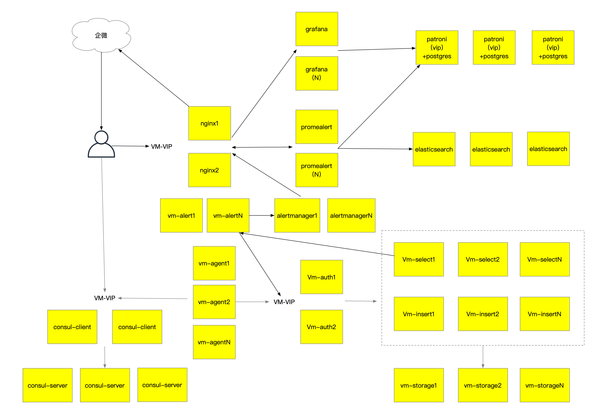
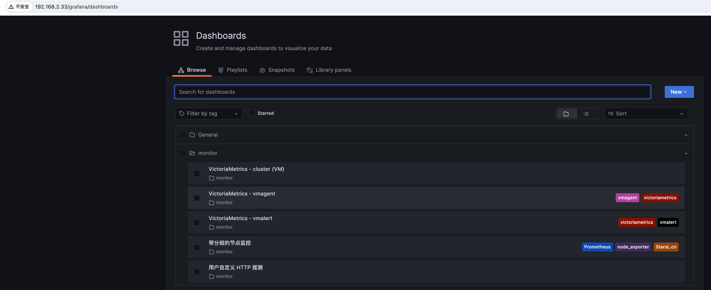
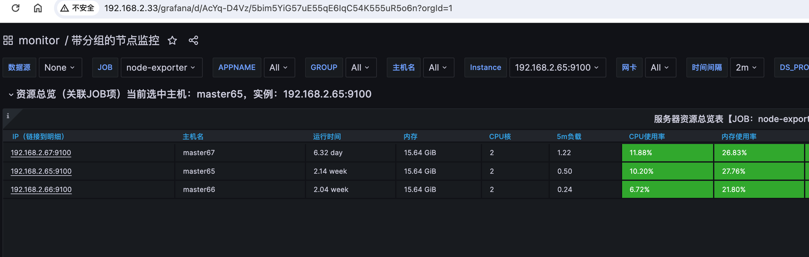
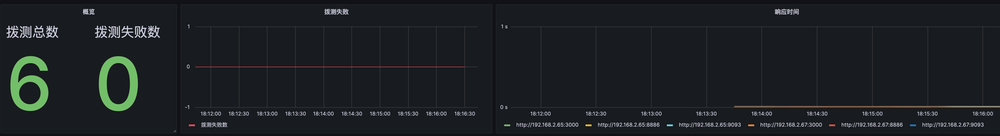
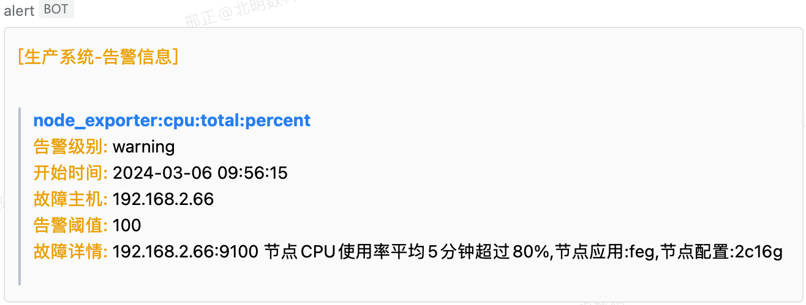
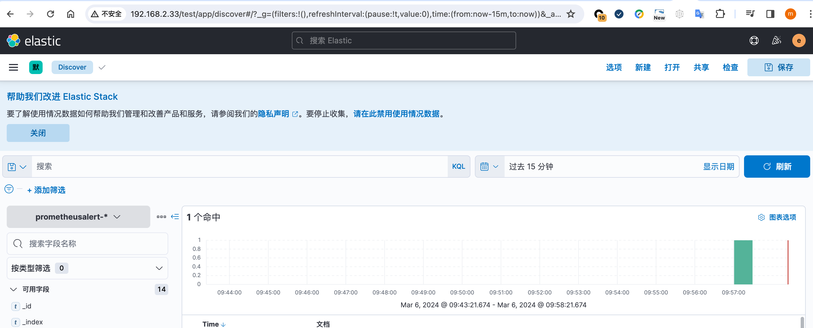

## vmmetrics
本文档旨在快速部署vmmetrics单机版及集群版，同时集成了告警组件，elastic组件，grafana组件，来达到部署即可用的状态，默认支持node-exporter监控以及HTTP、TCP拨测等功能

## 版本及简介
```
更新简介
1、版本升级docker-20.10.23
2、新增密码修改，磁盘初始化
3、新增时间服务器chrony部署
4、适配arm64环境
5、新增registry私仓部署
6、新增containerd,nerdctl安装部署

版本详情
docker 20.10.23
docker-compose 1.29.2
containerd v1.6.21
congcong126/ansible:2.9.18
bitnami/consul:1.17.0
congcong126/nginx-check:1.25.4-alpine3.18-perl
victoriametrics/vmstorage:v1.95.1-cluster
victoriametrics/vminsert:v1.95.1-cluster
victoriametrics/vmselect:v1.95.1-cluster
victoriametrics/vmauth:v1.95.1
victoriametrics/vmagent:v1.95.1
victoriametrics/vmalert:v1.95.1
congcong126/grafana:9.4.3
prom/alertmanager:v0.25.0
congcong126/prometheus-alert:master
congcong126/elasticsearchx:7.17.15
kibana:7.17.15
osixia/keepalived
congcong126/patroni-postgres:12.17
telegraf:1.29.5-alpine
etcd-3.5.9.tgz
```
## 使用方法
### 目录简介
```
app_install  应用playbook目录
docker_common  docker配置文件目录
containerd_common containerd配置文件目录
group_vars  全局变量
system_init  初始化playbook目录
*.example  主配置文件范例
initialize  初始化脚本,如未安装docker则会安装临时使用的专用发布定制化dockerd，如易安装则会直接生成部署脚本
pkg  安装包目录
shell 生成可执行部署脚本
```

### 解压离线pkg包
```
cd pkg/ 
tar -xf base_pkg_x64.tgz
tar -xf elastic-7.17.15-x64.tgz
tar -xf vm-x64.tgz

#查看离线包
[xxx pkg]# ls
alertmanager.tgz  cni-plugins.tgz  docker-compose.tgz  es_plugins.tgz  keepalived.tgz  node_exporter   registry.tgz  vmalert.tgz   vmselect.tgz
ansible.tar.xz    consul.tgz       docker.tgz          etcd-3.5.9.tgz  kibana.tgz      postgres.tgz    telegraf.tgz  vmauth.tgz    vmstorage.tgz
bin               containerd.tgz   elasticsearch.tgz   grafana.tgz     nginx.tgz       promealert.tgz  vmagent.tgz   vminsert.tgz
```

### 主配置文件详解
```
#delegate_ip这里务必修改发布机的ip地址,可以是本机地址也可以不是本机地址
#关于下面密码类的建议务必修改一下
#vm_vip是部署时用来做入口地址的，配合keepalived实现高可用，如果在云上需要申请高可用HAVIP地址
#PATRONI_VIP是部署是用来做数据库请求地址的，配置patroni+脚本实现高可用，如果在云上需要申请高可用HAVIP地址
#下列为主机组，可以定义各个组件部署的主机及相关配置
[node_exporter]
192.168.2.67 group=ss appname=cdf specs=2c16g
192.168.2.65 group=bb appname=dfe specs=2c16g
192.168.2.66 group=cc appname=feg specs=2c16g

[test]
192.168.2.67

[docker]
192.168.2.67 registry=true
192.168.2.65
192.168.2.66

[keepalived]
192.168.2.67 keepalived_interface=eth0 keepalived_state=MASTER keepalived_rid=71 keepalived_pri=100 keepalived_vip="{{vm_vip}}" keepalived_authtype=PASS keepalived_authpass=2wsx@WSX
192.168.2.65 keepalived_interface=eth0 keepalived_state=BACKUP keepalived_rid=71 keepalived_pri=80 keepalived_vip="{{vm_vip}}" keepalived_authtype=PASS keepalived_authpass=2wsx@WSX
#192.168.2.66 keepalived_interface=eth0 keepalived_state=BACKUP keepalived_rid=71 keepalived_pri=81 keepalived_vip="{{vm_vip}}" keepalived_authtype=PASS keepalived_authpass=2wsx@WSX

[nginx]
192.168.2.67
192.168.2.65

#crole用来定义服务部署角色
[consul]
192.168.2.67 crole=server,client
192.168.2.65 crole=server,client
192.168.2.66 crole=server

[alertmanager]
192.168.2.67
192.168.2.65

[grafana]
192.168.2.67
192.168.2.65

[promealert]
192.168.2.67
192.168.2.65

[vmstorage]
192.168.2.67
192.168.2.65

[vmselect]
192.168.2.67
192.168.2.65

[vminsert]
192.168.2.67
192.168.2.65

[vmagent]
192.168.2.67 vmagent_memberNum=0
192.168.2.65 vmagent_memberNum=1

[vmalert]
192.168.2.67
192.168.2.65

[vmauth]
192.168.2.67
192.168.2.65

[etcd]
192.168.2.66 hostname=master65
192.168.2.65 hostname=master66
192.168.2.67 hostname=master67

[postgres]
192.168.2.67 hostname=master67  pgrole=a
192.168.2.65 hostname=master65  pgrole=b
192.168.2.66 hostname=master66  pgrole=b

[elasticsearch]
###es_node_roles="master, data_hot, data_content, data_warm, data_cold, data_frozen, ingest, ml, remote_cluster_client, transform"
###If es_node_roles is master and does not participate in competition, it can be set to "master, voting_only"
192.168.2.67 init=true ES_JAVA_OPTS="-Xms2g -Xmx2g" es_node_roles="master, data_hot, data_content, data_warm, data_cold, data_frozen, ingest, ml, remote_cluster_client, transform"
192.168.2.65 ES_JAVA_OPTS="-Xms2g -Xmx2g" es_node_roles="master, data_hot, data_content, data_warm, data_cold, data_frozen, ingest, ml, remote_cluster_client, transform"
192.168.2.66 ES_JAVA_OPTS="-Xms2g -Xmx2g" es_node_roles="master, data_hot, data_content, data_warm, data_cold, data_frozen, ingest, ml, remote_cluster_client, transform"

[kibana]
192.168.2.67
192.168.2.65

[blackbox-exporter]

[mysqld-exporter]

[redis-exporter]

[rabbitmq-exporter]

[consul-exporter]

[promtail]

[telegraf]
192.168.2.65
192.168.2.66

#下面是全局参数配置
[all:vars]
# ssh 配置
server_password='MX5GSY#f9VnU'
ansible_ssh_port=22
ansible_ssh_user=root
base_dir="{{playbook_dir}}"
ansible_ssh_private_key_file=/root/.ssh/id_rsa
docker_basedir=/bmsk

#命名前缀
name_prefix="vm"
#指定安装目录
install_path="/data/{{name_prefix}}"
push_ssh_key=True
ansible_ssh_extra_args='-o StrictHostKeyChecking=no'
ansible_ssh_pipelining=True

#发布机IP
delegate_ip=192.168.2.67

#私仓和containerd数据存放
image_registryDomain="ae.com"
image_registryPort="5000"
image_registryPassword=nfm88yGxxxxxxxxx
image_registrycriData=/data/containerd
image_registryData=/data/registry

#install_docker
#daemon.json里可自定义的值
#docker的家目录
docker_graph=/data/docker
#docker默认使用的ip池
docker_bip=11.111.0.1/24
#docker使用的镜像仓库地址
registry_mirrors=https://docker.mirrors.ustc.edu.cn
#docker-compose的地址池
default_address_pools=11.111.100.1/20
#默认添加的伪装地址,用于节点间通信
NET_MASQUERADE=11.111.0.0/16

#changepass
#修改多个密码需要修改用户名和密码，多次依次执行
changepass_user="root"
changepass_password="N4YCkje24Sc^"

#users
#安装rke使用的普通用户
customuser=ae
#安装rke使用的普通用户密码
userpassword="youcustom"

#ntp server
#指定ntpserver的模式，支持ntpdate和chrony两种，根据系统情况自定即可
use_ntpdate=true
ntp_server="192.168.2.67"
ext_ntp_server=ntp1.aliyun.com

# hostname
region=bj
organization=hwcloud

#image
consul_image="bitnami/consul:1.17.0"
nginx_image="congcong126/nginx-check:1.25.4-alpine3.18-perl"
vmstorage_image="victoriametrics/vmstorage:v1.95.1-cluster"
vminsert_image="victoriametrics/vminsert:v1.95.1-cluster"
vmselect_image="victoriametrics/vmselect:v1.95.1-cluster"
vmauth_image="victoriametrics/vmauth:v1.95.1"
vmagent_image="victoriametrics/vmagent:v1.95.1"
vmalert_image="victoriametrics/vmalert:v1.95.1"
grafana_image="congcong126/grafana:9.4.3"
alertmanager_image="prom/alertmanager:v0.25.0"
promealert_image="congcong126/prometheus-alert:master"
es_image="congcong126/elasticsearchx:{{es_version}}"
kibana_image="kibana:{{es_version}}"
keepalived_image="osixia/keepalived"
postgres_image="congcong126/patroni-postgres:12.17"
telegraf_image="telegraf:1.29.5-alpine"
etcd_image="etcd-3.5.9.tgz"

#nginx
nginx_monit_port=80
#临时文件大小
proxy_max_temp_file_size=1024m
#客户端最大请求字节
client_max_body_size=1024m

#prometheus
#alerts in prometheus_install/app_install/pkg/prometheus/conf/alerts,Default Only  added node_exporter template,The corresponding alarm template can be added manually according to the demand
# alarm template "node_exporter,mysqld_exporter,rabbitmq_exporter,redis_exporter"
#prometheus_port="9090"
#WEB_URL_PATH=prome
#tsdb_retention_time=90d

#vmstorage
vmstorage_Listen=":8482"
vminsertAddr=":8400"
vmselectAddr=":8401"
vmstorage_FreeDisk="1GiB"
vm_minScrapeInterval=30s
vm_loggerFormat=json
vm_logtz="Asia/Shanghai"

#vmauth
vmauth_select_user=select-account-1
vmauth_insert_user=insert-account-1
vmauth_pass="Ae2023%%"
vmauth_Listen=":8427"
vm_vip=172.21.0.5

#vminsert
#集群模式写入副本数，为2表示最多可丢失一台服务器
vminsert_rpF=2
vminsert_Listen=":8480"

#vmselect
vmselect_Listen=":8481"
#vmselect代理vmalert，通过nginx进行负载均衡代理:"http://{{vm_vip}}:8879"
vmalert_proxyURL="http://{{vm_vip}}:8879"

#vmagent
vmagent_Listen=":8429"
#集群模式写入副本数，为2表示最多可丢失一台服务器
vmagent_rpF=2
vmagent_scrape_interval=15s
#vmagent和vmauth同副本，同节点部署可以设置为127.0.0.1，否则remoteWriteip="{{vm_vip}}"
remoteWriteip="{{vm_vip}}"

#vmalert
vmalert_Listen=":8880"

#consul
consul_ip="{{groups['consul'][0]}}"
#consul客户端的ip
consul_port="8510"
#consul服务器的ip
consul_server_port="8500"
CONSUL_DATACENTER=dc1
CONSUL_DOMAIN=ae-monitor

#alertmanager
alertmanagers_ip="{{groups['alertmanager'][0]}}"
alertmanagers_port="9093"
qywx_webhook_robot="https://qyapi.weixin.qq.com/cgi-bin/webhook/send?key=aadda3a4-bf5c-4e3b-85aa-ba9f0e4d1e1c"
alertmanager_retention=2160h

#grafana
#如果 GRAFANA_ROOT_URL 不为空则必须使用代理，设置:"GRAFANA_ROOT_URL=grafana/"
GRAFANA_ROOT_URL=grafana/
GF_SECURITY_ADMIN_PASSWORD=a2n6dbAxxxxxxxxx
grafana_vmauth=true
GRAFANA_DB_DRIVER=postgres
GRAFANA_DB_HOST={{PATRONI_VIP}}
GRAFANA_DB_PORT=5432
GRAFANA_DB_USER=postgres
GRAFANA_DB_PASS={{PATRONI_SUPASS}}
GRAFANA_DB_NAME=grafana
GRAFANA_DB_SSL=disable


#promealert
#参考连接https://github.com/feiyu563/PrometheusAlert
PA_APPNAME=AlertCenter
PA_PORT=8886
PA_LOGIN_USER=admin
PA_LOGIN_PASSWORD=123456
PA_TITLE=AlertCenter
PA_CST_TIME=1
PA_RECORD=1
PA_OPEN_FEISHU=1
PA_OPEN_DINGDING=1
PA_OPEN_WEIXIN=1
PA_es_enable=1
PA_es_addr="http://192.168.2.66:9200;http://192.168.2.65:9200;http://192.168.2.67:9200"
PA_es_username="elastic"
PA_es_passwd="{{elasticsearch_password}}"
PA_DB_DRIVER=postgres
PA_DB_HOST={{PATRONI_VIP}}
PA_DB_PORT=5432
PA_DB_USER=postgres
PA_DB_PASS={{PATRONI_SUPASS}}
PA_DB_NAME=prometheusalert

# es
#es pls use username elastic
#cluster_type only single-node and cluster,default single-node
cluster_type=cluster
es_version=7.17.15
es_cluster_name="{{region}}-{{organization}}"
#cluster_type="single-node"
elasticsearch_username="userone"
elasticsearch_password="kIHqaACIlbMxxxxxxxxx"
es_conn_users_pass="zJjFxt5u3wIxxxxxxxxx"
#Set to system memory 80%,Maximum no more than 31G
#设置为系统内存80%，最大不超过31G
#ES_JAVA_OPTS="-Xms2g -Xmx2g"
xpack_security_audit_enabled=false
# when xpack_security_http_ssl_enabled=true,elatic will enable ssl count and set api keys
# 当 xpack_security_http_ssl_enabled=true 时，elatic 将启用 ssl 计数并设置 api 密钥
xpack_security_http_ssl_enabled=false
ingest_geoip_downloader_enabled=false
indices_fielddata_cache_size=20%
indices_memory_index_buffer_size=20%
indices_memory_min_index_buffer_size=96mb
thread_pool_write_queue_size=30
indices_query_bool_max_clause_count=10240
cluster_max_shards_per_node=10240
plugins_enable="true"

#kibana
###Language can set en or zh-CN or ja-JP
kibana_i18n_locale=zh-CN
###xpack ture or false
kibana_32_encryptionKey="VIxIkwUUbbN85WO8aqocL7wxxxxxxxxx"
kibana_port=5601
xpack_reporting_capture_browser_chromium_disableSandbox=false
elasticsearch_ssl_verificationMode=none
###enable: rewrite_enable=on
kibana_rewrite_enable=on
kibana_server_basePath="/test"
kibana_server_rewriteBasePath=true

#mysqld_exporter
#if monit mysqld you master create exporter user and grant *.* PROCESS, REPLICATION CLIENT, SELECT;
#CREATE USER 'exporter'@'%' IDENTIFIED BY 'exporter_hp'
#GRANT PROCESS, REPLICATION CLIENT, SELECT ON *.* TO 'exporter'@'%';
#flush privileges
MYSQL_USER=exporter
MYSQL_PWD=exporter_hp
MYSQL_PORT=3306

#redis_exporter
REDIS_PWD=JACcGa2xxxxxxxxx
REDIS_PORT=6379

#rabbitmq_exporter
RABBIT_ADMIN_PORT=15672
RABBIT_USER=admin
RABBIT_PASSWORD=test123456
RABBIT_PUBLISH_PORT=9419

#node_exporter
#Generated by htpasswd and generated by the password set by "node_exporter_passwd", the generation command is "htpasswd -nBC 10 "" | tr -d ':\n'"
node_exporter_port=9100
node_exporter_admin=prometheus
node_exporter_passwd='xxxxxxxxx@&k0Z'
#skip tls
insecure_skip_verify="false"
#open ssl
node_exporter_tls="false"

#etcd
#设置主机名
etcd_hosts_entries=[{{etcd_hosts_lines}}]
#设置集群token
etcd_token="etcd-qvpgn5g"

#postgresql
#详细参数可参考https://hub.docker.com/repository/docker/congcong126/patroni-postgres/general
PATRONI_SCOPE=ae
#PG_MODE为pgsql运行模式，分为单机版single和集群版patroni
PG_MODE=patroni
#当PG_MODE=single时，该密码生效，为postgres初始密码
POSTGRES_PASSWORD=Uah2gwtE33yl
PATRONI_SUPASS=Uah2gwtE33yl
PATRONI_REPPASS=VonCOfJchPYb
PATRONI_VIP=172.21.0.4

#telegraf
#详细参数可参考https://hub.docker.com/_/telegraf
telegraf_interval="30s"
telegraf_prome_port=":9273"

#openssl
#openssl_domain 用于自签名的域名，多个域名使用方式"a.com","b.com" 
#会根据hosts中的组列表获取自签名证书ip
openssl_C=CN
openssl_ST=BJ
openssl_L=BJ
openssl_O=work
openssl_OU=work
openssl_CN="WORK ONLY CA"
openssl_domain="{{image_registryDomain}}","*.{{image_registryDomain}}"
openssl_days=36500
openssl_RSA=2048
openssl_ea="-sha256"
openssl_asym="rsa"
ROOT_CA_PRIVATEKEY=CA_PRIVATEKEY.key
ROOT_CA_CSR=CA_CSR.csr
ROOT_CA_CERT=CA_CERT.crt
SERVER_PRIVATEKEY=work_server.key
SERVER_CSR=work_server.csr
SERVER_CRT=work_server.crt
```

### 创建主配置文件
```
#需要根据自己的情况修改主配置文件
copy hosts_ovpn.example hosts
```

### 执行批量命令
#### 首次使用需执行初始化，如果没有docker环境会安装临时部署docker环境，如系统由docker环境则进生产部署脚本
```
#首先生成配置文件，集群版至少需要3台服务器，使用hosts_cluster.example，单机版至少1台服务器，使用hosts_single.example
#生成配置文件后要根据自己的实际情况进行参数修改，设置部署目录，密码，ip地址等等务必要按需修改
cp hosts_cluster.example hosts or cp hosts_single.example hosts
#初始化安装，会/opt/docker_bin安装docker，仅供安装工具使用，生产使用需要执行install_docker.sh安装，并在当前目录生成可执行脚本
sh initialize hosts
```

#### 批量系统优化工具(按需执行)
```
#批量配置免密登录
sh ssh.sh hosts
#修改密码
sh changepass.sh hosts install
#批量修改主机名(建议修改适合环境hosts)
#修改地区及环境业务名称，主机名例子bj-who-docker-192.168.2.66
sh hosts.sh hosts
#批量初始化服务器
sh system_init.sh hosts
```

#### 批量安装容器环境(如果已经安装docker环境可忽略)
```
#批量安装docker环境
sh install_docker.sh hosts install
```

#### 服务部署
```
##安装elastic服务
#生成自签名证书并同步所有主机(因elastic的集群通信端口使用的是ssl协议所以必须生成自签证书)
sh sslkey.sh hosts install
#安装elasticsearch及kibana
sh elasticsearch.sh hosts install && sh kibana.sh hosts install

##安装grafana及告警中心s及高可用服务
sh etcd.sh hosts install
sh postgres.sh hosts install
sh promealert.sh hosts install
sh grafana.sh hosts install
sh keepalived.sh hosts install
sh nginx.sh hosts install
sh consul.sh hosts install

##安装VictoriaMetrics
sh vmstorage.sh hosts install
sh vmalert.sh hosts install
sh vmselect.sh hosts install
sh vminsert.sh hosts install
sh vmauth.sh hosts install
sh vmagent.sh hosts install
sh alertmanager.sh hosts install 
sh node_exporter.sh hosts install
sh telegraf.sh hosts install
```

##服务情况
### 部署架构图


### grafana大盘




### 告警


